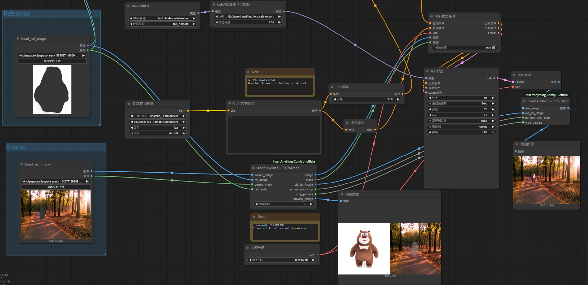
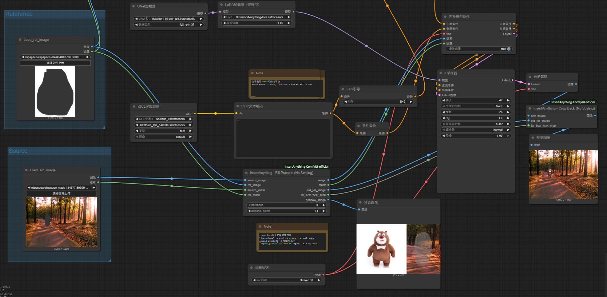

This repository provides the official ComfyUI workflow for [Insert Anything](https://github.com/song-wensong/insert-anything).


## 🔧 Installation

We offer two methods for installing InsertAnything-ComfyUI.

### Prerequisites

Please first install [ComfyUI](https://github.com/comfyanonymous/ComfyUI/tree/master) with the following commands:

 ```shell
	git clone https://github.com/comfyanonymous/ComfyUI.git
	cd ComfyUI
	pip install -r requirements.txt
 ```

 ### ComfyUI-Manager

 1. Install [ComfyUI-Manager](https://github.com/ltdrdata/ComfyUI-Manager) with the following commands:

 ```shell
	cd custom_nodes
	git clone https://github.com/ltdrdata/ComfyUI-Manager
 ```

 2. Launch ComfyUI:

 ```shell
	cd ..	# Make sure you are in the ComfyUI root directory
	python main.py
 ```
 3. Open the `ComfyUI Manager`, select `Install via Git URL`, input the URL:

 ```shell
	https://github.com/mo230761/InsertAnything-ComfyUI-official.git
 ```

 4. Move the `InsertAnything.json` file into your local ComfyUI's user/default/workflows directory.
 ### Manual Installation
  1. Clone this repository into the `custom_nodes` directory inside ComfyUI:

 ```shell
	cd custom_nodes
	git clone https://github.com/mo230761/InsertAnything-ComfyUI-official.git
 ```
  2. Move the `InsertAnything.json` file into your local ComfyUI's user/default/workflows directory

  3. Launch ComfyUI:

 ```shell
	cd ..	# Make sure you are in the ComfyUI root directory
	python main.py
 ```

## 🚀 Usage Examples

Using this workflow (`workflows/InsertAnything.json`), the source image and ref_image are cropped and scaled to a standard size of 768*768 to generate the image.

The effect is shown in the figure below.



The Insert Anything LoRA still performs well at larger resolutions. Therefore, to avoid image quality loss caused by processing images to 768*768, you can also use this workflow (`workflows/InsertAnything_noscaling.json`) to only crop the image for generation. In this case, you can set the image resolution more freely.

The effect is shown in the figure below.


